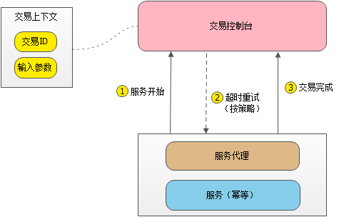
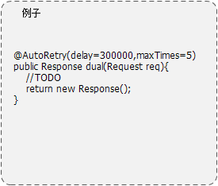

# 交易重试服务

## 业务痛点
- 交易过程中，异常不可避免，异常发生后，交易发生了中断。
- 为了保证交易的闭环，我们通常的做法是编写自动任务，扫描出现问题的交易，重新发起。
- 随着交易的增多，我们的自动任务也越来越多，扫描交易数据的压力也越来越大。
- 有多少交易处于异常状态，我们并不可视，往往需要配套相应的监控。

## 构思
- 重试的自动任务，是否是一个固定模式的工作？
- 交易重试这个重复性的工作，能否做到自动？

## 方案
给交易服务增加代理，交易过程中发送信号到交易控制台，由交易控制台管理交易服务的生命周期。服务应支持幂等，中断后能够重新运行，运行到终态。

### 角色说明
- 交易控制台 - 管理交易的生命周期，保证交易的完整性。
- 交易上下文 - 保存交易的基本信息，用于交易管理和交易的重新发起。
- 交易服务容器 - 交易运行的基本框架，包含交易服务和代理。

